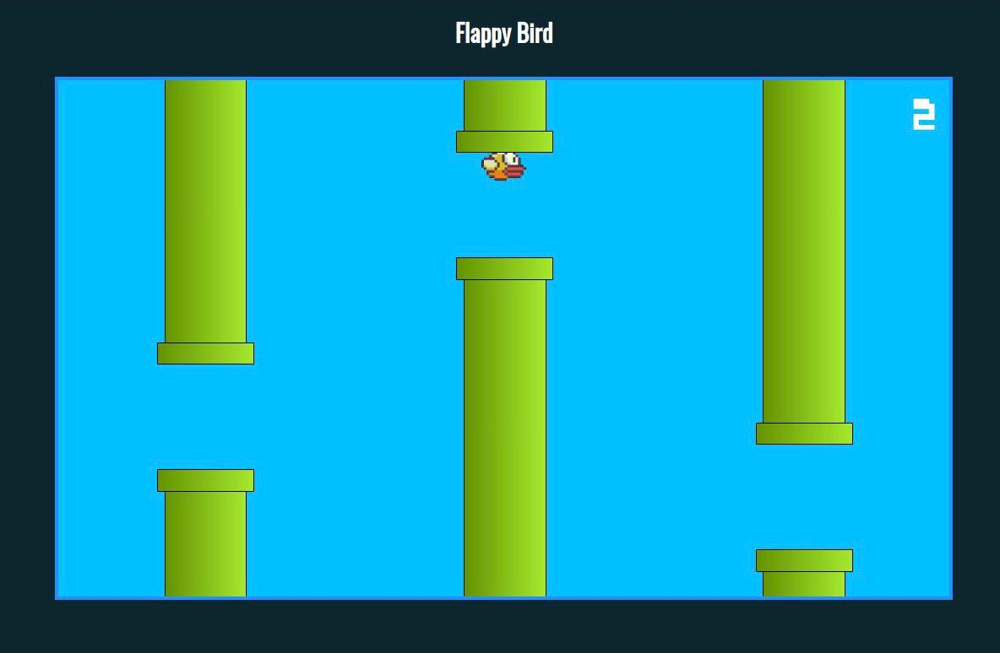

<h1 align="center"> Flappy Bird </h1>

Promovido pela Cod3r Cursos Online de Tecnologia.

  <a href="#-tecnologias">Tecnologias</a>&nbsp;&nbsp;&nbsp;|&nbsp;&nbsp;&nbsp;
  <a href="#-projeto">Projeto</a>&nbsp;&nbsp;&nbsp;|&nbsp;&nbsp;&nbsp;
  <a href="#-layout">Layout</a>&nbsp;&nbsp;&nbsp;|&nbsp;&nbsp;&nbsp;
  <a href="#memo-licença">Licença</a>

  

 

  

## 🚀 Tecnologias

Esse projeto foi desenvolvido com as seguintes tecnologias:

- JavaScript e DOM
- HTML e CSS
- Git e Github

## 💻 Projeto

Clone do game Flappy Bird para demonstrar os conhecimentos de manipulação de elementos usando o DOM (Document Objetc Model).

## 🔖 Layout

Você pode visualizar o layout do projeto através [DESSE LINK](https://www.udemy.com/course/curso-web/).

## :memo: Licença

Esse projeto está sob a licença MIT.

---

Feito com ♥ by Weverson Rodrigues
